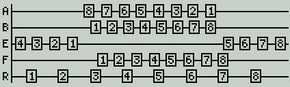

# Add-ons

The OpenTX community is a thriving and exciting place to be.  Many
Third Party add-ons work with the radios. This list is probably
incomplete. If you think your (or someone else's) add on belongs here,
do not hestiate to tell us.

## Horus
LView - https://github.com/RealTadango/FrSky/tree/master/LView - Lua log viewer for FrSky Horus with OpenTX

## Taranis
* [LuaPilot](https://github.com/ilihack/LuaPilot_Taranis_Telemetry) - Telemetry screen for Arducopter

* [Open-Tm](https://github.com/resourcepool/open-tm) - Telemetry screens
mainly for models with acclerometer (includes Betaflight with telemetry)

* [FPV Frequency chart](https://github.com/darsor/opentx-frequency-chart)

 

## Sound packs

Beware that these sound packs might not be update with SD card conents and might be missing some sound files from newer releases.

### English
[Joanne Soundpack on RCGroups](https://www.rcgroups.com/forums/showthread.php?2888433-OpenTX-Soundpack-Joanne) 

Amber Sound pack - [https://www.dropbox.com/s/3t7p9t6ykufhsfx/Amber22.rar?dl=0](Download only)
["Mia" Taranis Voicepack](https://miawinther.bandcamp.com/album/mia-taranis-voicepack) (commercial - 5 USD)
