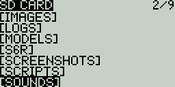
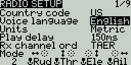
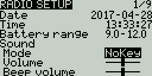
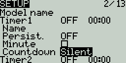
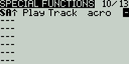

# Sounds & Announcements

OpenTX makes sounds in two ways:
1. Generating tones/beeps of different frequencies and durations
2. Playing audio files if present on a microSD card

One of the main features of OpenTX is its use of a sound pack placed on a microSD card. This sound pack contain audio files files used for sounds and announcements.

Sounds & Announcements take place in response to
- Model Independent event (events not related to model loaded)
- Model Dependent events (events related to model loaded)
- Global & Special Function triggers

## microSD Card

Check the Tx documentation from the manufacturer to determine which microSD card to use. To use the microSD card insert it in the card slot.
- Format: FAT12/16/32

### Version Warning

If an microSD Card is present when the Tx is turned on OpenTX check its root/top level folder for a file to determine if the correct sound pack version is being used.
- opentx.sdcard.version

  

If the incorrect version is being used then it is possible that some announcements such as telemetry units will be incorrect.

## Sound Packs

A sound pack is available from within Companion.
- File > Download
- Extract the ZIP file to the root/top level folder of the microSD Card.  It will create the necessary sub-directories
  E.g. SOUNDS/en for the English pack

  

### Announcement To File Mapping / Definitions

The sound mapping/definitions file is used to generate audio files with phrases such as telemetry lost/recovered and units.
- SOUNDS/language/SYSTEM/language-country-tx.csv
  E.g. SOUNDS/en/SYSTEM/en-US-taranis.csv

It is a text file with lines of text. One line per sound file. Each line has three parts separated by semicolons.
- directory/;file_name.wav;Spoken phrase
  E.g. SOUNDS/en/SYSTEM;hello.wav;Welcome to open tea ex!

### Audio File Format

- File Name: 12345678.wav (up to 8 characters plus .wav)
- Sample Rate: 32 kHz (or 16 Khz, 8Khz)
- Bits / Sample: 16 (or 8)
- Tracks: 1, mono
- Compression Codec: PCM (or u-law, a-law)

### Audio File Locations  & Language Setting

On the Tx SD CARD in the following folders
- SOUNDS/
  - The root, top level
- SOUNDS/language/
  - Files used by Global & Special Functions
  - Different languages are supported
    E.g. SOUNDS/en/, SOUNDS/de/
  - The language is set on the RADIO SETUP screen

    
- SOUNDS/language/SYSTEM/
  - Files used by the system
- SOUNDS/en/model_name_folder/
  - Files used for some model events

## Model Independent

These sounds and announcements are not related to which model is loaded. They are configured in one of the following ways:
- Adding  to or removing a sound file from the folder
  - SOUNDS/language/SYSTEM/
- Configuring options on the Radio SETUP screen

  
- Radio GLOBAL FUNCTIONS screen

  

Events that may generate sounds and announcements are:
- Transmitter turned on and off
  E.g. SOUNDS/en/SYSTEM/hello.wav and SOUNDS/en/SYSTEM/bye.wav
  Note: bye.wav is not provided but will be played if present
- Trim up, down, center, ends/limits
- Telemetry lost, recovered
- Tx battery level low
- RF signal level low or critical
- Inactivity period reached (no sticks, switches, buttons or knobs were used)
- Throttle stick not all the way down when model is loaded
- Bad eeprom
- Tx antenna defective
- Trainer signal lost, recovered
- Sensor signal lost
- Servo, Receiver power overload (when using the FrSKY Redundancy Bus)
- Tx button presses and scroll wheel/knob turn
- Binding
- Range check

## Model Dependent

These sounds and announcements are related to which model is loaded. They are configured in one of the following ways:
- Adding  to or removing a sound file from the folder
  - SOUNDS/language/model_name
- Configuring options on the Radio SETUP screen

  
- Radio SPECIAL FUNCTIONS screen

  

Events that may generate sounds and announcements are:
- Timer seconds, count down reaches zero
- Switch, Slider or Pot not in a particular position when model loaded
- Center position beep for sticks, sliders and potentiometers
- Switch position changes
- Flight mode changes

### Model Folder Sound Files

To play sounds specific to a model without configuring them as a Special Function place sound files in the following folder:
- /SOUNDS/language/model_name/
  - Replace model name spaces with an underscore "_"
    E.g. /SOUNDS/en/my_model/

The file names use the following format:
- Switches & Logical Switches
  - switchID-position.wav
    SA-up.wav, L1-up.wav \(true\)
    SA-mid.wav \(if position present\)
    SA-down.wav, L1-down.wav \(false\)
    Note: There is no equivalent for SA not up.
- Multiple Position Switches / Stepped Potentiometers
  - P-switchNumber-position.wav
    P11.wav
    P16.wav
    P24.wav
- Flight Modes
  - modeName-condition.wav
    No spaces in the flight mode name
    ABC–off.wav
    ABC–on.wav

## Global & Special Functions

Configuration details for these functions are covered under [Special Functions](https://opentx.gitbooks.io/manual-for-opentx-2-2/content/special_functions.html)

Play Actions
- Play Track
  - Pick a file from the list.
  - Uses files placed in SOUNDS/language/
- Play Value
  - Say the value of the selected parameter when the switch is active.

Enable options for both of the above are
- Played once, not during start up
  - Play once when triggered but not when model is loaded, don't repeat it
- No repeat
  - Play once when triggered, don't repeat it
- 1s to 60s
  - Play once and then again every interval specified from 1 to 60 seconds

Music Actions
- BgMusic
  - Starts playback of a background sound track picked from a list
  - Uses files placed in SOUNDS/language/
  - The switch must stay on to continue playback
  - If the switch is turned off and then on again playback starts from the beginning
-- BgMusic II
  - Pauses the active BgMusic
  - When the switch is turned off playback continues from where it was paused
  - The BgMusic switch must remain on

Other Actions
- Vario
  - Generates the tone/sound of a glider variometer
  - Uses altitude or vertical speed telemetry data
- Volume
  - Adjusts the audio volume for the entire radio
  - Use any input from the list
    E.g. S1

## Volume

The audio volume may be configured and controlled from three locations:
1. [RADIO SETUP](https://opentx.gitbooks.io/manual-for-opentx-2-2/content/radio_menus.html) screen
2. [GLOBAL FUNCTIONS](https://opentx.gitbooks.io/manual-for-opentx-2-2/content/special_functions.html) screen
3. [SPECIAL FUNCTIONS](https://opentx.gitbooks.io/manual-for-opentx-2-2/content/special_functions.html)screen
Details of each are covered under the relevant sections.
