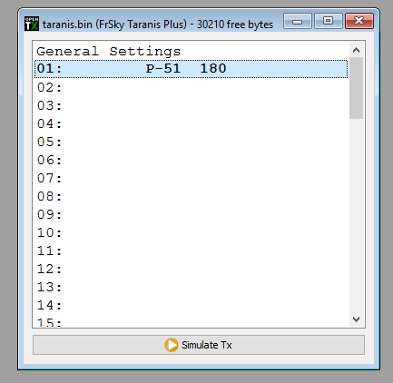
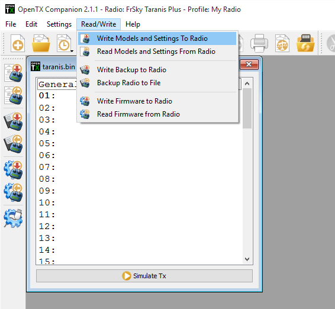
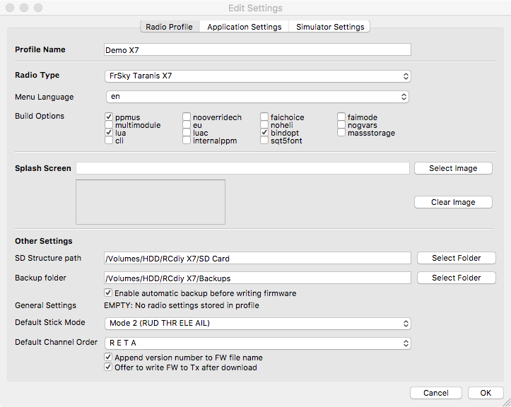
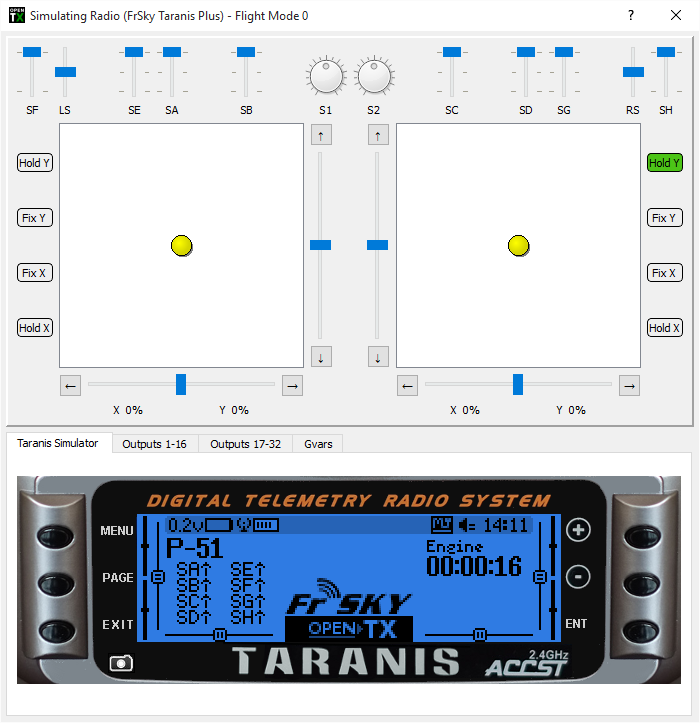
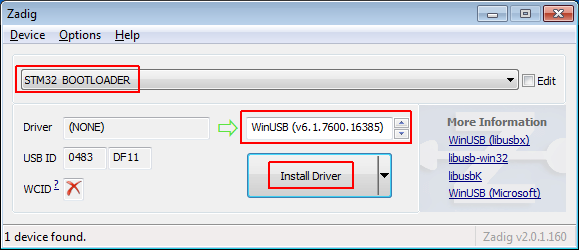
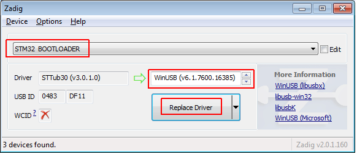
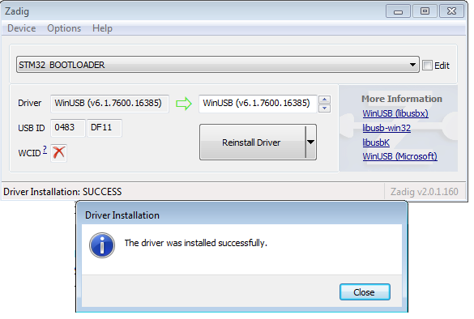

# Introduction to OpenTX companion

OpenTX comes with a computer-based counterpart that runs on Windows, Mac OS and Linux, OpenTX Companion.  This software will allow you to backup, edit and share your radio's settings.  It can also simulate both a model's setup and the radio's own interface on the computer.  It is a great tool to try things even without a radio.  It can speed up new model setups because the PC interface is not limited to a small screen and a few buttons.

## Basic concepts

OpenTX companion handles 2 main tasks:
* Managing radio settings and models
* Downloading new radio firmwares, and transferring them to the radio.

An important thing to understand is how things are stored on the radio. We will talk of 2 different types of memories, Flash and EEPROM.
* Flash is the memory where the radio's firmware or "operating system" resides. "Flashing the radio" means replacing the firmware.   Flashing the radio allows you to upgrade to a newer version or to change language.  Models and settings are not affected when flashing the firmware.  On the Taranis, flashing is done with the radio OFF.  So turn the radio off, then plug it to the computer's USB port.
* EEPROM is the separate settings/model memory.  Reading it allows backing up and editing in OpenTX companion, writing it sends the result of the edits back to the radio.  On the Taranis, this is done with the radio ON. Turn it on, dismiss any warnings in order to get to the main views, then plug the USB cable. You will see two USB drives appear, one is the SD card, and one is the EEPROM virtual drive.

OpenTX Companion will thus handle 2 different types of files.

Firmware files, that can be downloaded from the Preferences dialog, which are non-editable and can just be transferred to/from the radio, and EEPROM files for which OpenTX companion provides an editor that allows to change anything in the same way that would be done on the radio itself.

When creating (File->New) or opening (either by dragging it onto the main window or via the File->Open menu command) an EEPROM file, a document window will appear.

Several of those windows can be open at the same time, allowing you to copy models or settings between files.

Trying to open a firmware file the same way will throw an error saying the file is invalid - this doesn't mean that the firmware is invalid, but simply that it is not a settings file.

The document window consists in a "General Settings" entry on which you can double-click to access the radio settings, and a number of model slots (60 for the Taranis).

The model slot that is displayed in bold is the one that is currently selected on the radio.

It can be chosen in OpenTX companion by right-clicking on the model slot, and choosing "Use as default".

Double-clicking on a model slot will open the editor for that model, creating one if it was empty.

Memory operations to/from the radio are handled by the different entries of the "Read/Write" menu:
* Read EEPROM from TX will read the EEPROM contents from the radio, and open them in a new document in OpenTX companion. The document is opened for editing, but is not saved to disk automatically.
* Write EEPROM to TX sends a currently open and selected document (if you have more than one open, make sure to click on the one you want to transfer first to select it) to the radio.
* Read EEPROM memory to File will read the EEPROM contents from the radio directly into a file. This is the preferred way to backup your radio's settings as it will be saved "as is" without OpenTX companion processing it. Click the entry, choose a location and filename, and save.
* Write EEPROM memory from File will allow you to select a file, and will transfer it as is to the radio. This is the preferred way to restore a backup as again no processing is going on.
* Write Flash memory will flash the radio's firmware from the selected file. Once the file is selected, you have the option to replace the default splash screen with an image of your choice, or the default image selected in the preferences.
* Read Flash memory will back up the firmware that is currently on the radio to a file.

## Setting up OpenTX Companion for Taranis

The first thing is of course to download and install the appropriate version of OpenTX Companion for your system from the OpenTX home page.

Once the program is launched, you will see the main window.

Open the Settings Dialog with Settings->Settings.

There are three tabs.

Radio Profile:
* Profile name
* Radio type
* Menu Language
* Build Options
  * noheli: Removes the Heli CCPM mixer menu page.
  * notemplates: Removes the Templates menu page.
  * nogvars: Disables global variable support and the associated menu page.
  * ppmus: Displays channel values in microseconds instead of %.
  * sqt5font: An alternative display font.
  * faimode: Disables all telemetry except for RSSI and voltage, for compliance with contest regulations.
  * faichoice: Adds a menu entry in the radio general settings to enable FAI mode. Allows you to train on contest day with telemetry, then turn FAI mode on in the menu before the contest to disable telemetry. FAI mode can then not be turned off on the radio again without connecting to a computer to avoid cheating.
* Splash screen replacement settings: The splash screen is the image that is displayed on the radio's screen when powering it up. Downloaded firmwares come with the standard OpenTX logo, but many users like to customise it. So you can select a folder where you store your own splash screens, and select a default one either from a file or from OpenTX companion's library (note the library doesn't have Taranis-sized ones yet). Splash screens need to be 212x64 pixels for Taranis, up to 16 grayscales. You will be able to apply your splash screen choice when you flash the firmware.
* SD structure path: For radios with SD cards, Taranis and sky9x board, this lets you choose a folder on your hard drive where you have made a copy of what is on the SD card of the radio.  This allows OpenTX companion to populate the model image selector with the images that are on the card, and do the same for audio files.
* Backup Folder
* Default Stick mode and channel order: These will be applied when creating a new EEPROM document in OpenTX companion.
* Automatically add version number to firmware files: When downloading a firmware file, its name includes the selected options. If this box is checked, the revision number will be appended to the filename to make it more convenient to maintain files of different versions.
* Offer to write FW to TX after download. 

Application settings:
* Google Earth Executable
* Files to keep - number of firmware files to keep
* Automatic Backup Folder
* Enable writing automatic before writing firmware.
* Splash Screen Library
* User Splash Screens - location to store user created splash screens.

Simulator settings:
* Simulator Capture settings
* Software language
* Automatic update check at launch for both OpenTX companion itself and the selected firmware
* A choice of whether to display the welcome screen when launching OpenTX companion
* Simulator options: Whether to remember switch positions between 2 sessions (useful when closing the simulator to edit something and coming back), backlight color, and screenshot save location

* EEPROM backup folder: Not used for Taranis.
* Firmware type, language and options: this is where you will choose which firmware and radio type you will be using with OpenTX companion. It is important that these setting always match the firmware type and options currently on the radio. For Taranis the choice has been intentionally limited so that most of the functionality is available to everyone by default. A few "personal choice" options remain:

* Profiles: Allows storing different setting sets and easily switching between them. For example, if you have 2 different radios with different firmwares or board types it is not convenient to have to redo all settings (firmware selection, ticking options,...) every time you want to do operations on the other radio. So you can configure all settings, choose an empty profile with the number box, type a name to identify the particular radio, and click save. Do the same for the second radio. You will now be able to select the correct profile for the radio you are about to work on with the profile selector button and menu entry on OpenTX companion's main window. Note that the profiles can also store and retrieve each radio's stick calibration and hardware settings (voltage alarms, audio modes,...) from the General Settings page of an open document. This allows copying a document from one radio to the other without needing recalibration or reentering the hardware settings.

Joystick: This lets you configure a joystick to simulate the sticks in the radio simulator.
For a Taranis radio, the first thing you would do is select "OpenTX for FrSky Taranis" in the firmware dropdown. Select your firmware language, and the voice language. The top Download button will compile and download the latest available firmware version with the selected language and options. The bottom Download button will open your web browser on a page showing you a selection of voice packs available for the selected language.
Set your flight mode and preferred channel order in the dropdowns below, and dismiss the Preferences dialog with OK for now.

## Simulating the radio

You can now create a new document. A window will appear, with the first line being the radio's general settings, and the next being the model slots. You can have a look in the general settings and create a model by double-clicking in an empty slot.
There are 2 ways to simulate either a model or the whole radio.
* In the model editor, the bottom Simulate button will open the model simulator with the current settings. Note that if a change is made in the model while the simulator is open, it needs to be closed and reopened.
* At the bottom of the "document" window is a "Simulate Tx" button that will open a similar simulator, however this time with an extra tab showing the radio's LCD screen and UI buttons. The virtual radio will have the same data as the document when the simulator is started. Note that changes on the radio interface are not carried over back to the document.

## Flashing your Taranis radio

As mentioned before, the program of your radio can be replaced, either to change the display language or to take advantage of new functions or corrections.
The first thing to do is to power your radio off and connect it to your computer's USB port.

### Installing the driver (for Windows only)

This is only required the first time you flash your radio on a given computer. If already done you can skip this section.
* Download the Zadig utility for your operating system from its homepage: http://zadig.akeo.ie/
* Run it as Administrator (Right-click and select the relevant entry).
* In the big dropdown, you should find an entry named either "STM32 BOOTLOADER" or "STM Device in DFU mode". Select it, and click the "Install Driver" button.
* If you do not have one of those entries, choose Options -> List All Devices, and it should now appear in the list. Select it, and click the "Replace Driver" button. DO NOT do it for anything else than those 2 possibilities. If you see "FrSky Taranis Bootloader" you have connected your radio with power on instead of power off, and overwriting the driver with Zadig would render the SD card and models/settings inaccessible.

Zadig will install the driver, and should report success. When done you can dismiss the message and close it.

Should none of these options work, you can download the driver here and install it manually (instructions are on the download page).
When the driver is properly installed, you should see this in the device manager:

### Installing the flashing utility (for Mac OS and Linux)

Download and install the dfu-util package for Mac OS X, or the 32-bit / 64-bit package for Ubuntu 12.04 and later from the "Other Downloads" section of [this page](http://www.open-tx.org/downloads).

### Downloading and flashing the firmware

In OpenTX companion's preferences window, make sure the proper firmware is selected (OpenTX for FrSky Taranis, or OpenTX for Taranis Plus according to the hardware you have), and the language / options match your preference, then click the top Download button and select a location for the file. This will automatically build and download the latest available version of OpenTX for Taranis.
Close the Preferences window, and select the Burn -> Write Flash memory command. Make sure your radio is powered off and connected.
Browse for the file you just downloaded. It will be recognised automatically and the version will be displayed.
If you wish to replace the radio's splash screen, you can either load one from a file or select it from the available library, and click the "Substitute image in firmware" box.
Click "Burn to TX".
Once the progress bar is done and the success prompt is shown you can dismiss it and disconnect your radio :)
If you get an error about the dfu-util executable not being found, open the flashing tool settings with the Burn -> Configure menu item. Browse for the dfu-util executable, which should be:
On Windows: In the OpenTX companion installation folder (by default C:\Program Files\companion9x\dfu-util.exe on 32-bit systems, and C:\Program Files (x86)\companion9x\dfu-util.exe on 64-bit systems).
On Mac OS: /opt/local/bin/dfu-util.