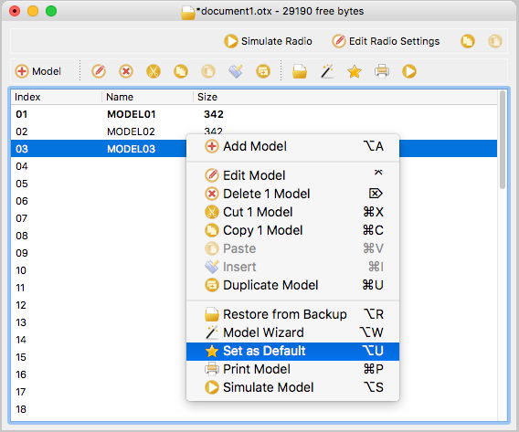

# Introduction to OpenTX Companion

OpenTX comes with a computer-based graphical user interface, OpenTX Companion, that runs on Windows, Mac OS and Linux.  This software will allow you to:
- Download and install OpenTX Transmitter Firmware
- Simulate transmitters and models (Try before you buy or fly)
- Edit real or simulated transmitter and model configurations
- Backup the transmitter’s firmware, models and SD Card contents
- Edit the OpenTX transmitter start up screen (splash screen)

## Download Companion
Download Companion from the [OpenTX website > Downloads](http://www.open-tx.org/downloads)

Select the most recent version at the top of the page
* OpenTX 2.2.0 (2017-05-30)

Please read the documentation on the page before downloading companion using the links at the bottom.

## Basic concepts

### Companion's Main Tasks

Companion handles 2 main tasks:
* Downloading new radio firmwares, and transferring them to the radio.
* Managing radio settings and models

### Memory
It is important to understand how information is stored on the radio. We will discuss 2 different types of memories, Flash and EEPROM.
* **Flash** is the memory where the radio's firmware or "operating system" resides. "Flashing the radio" means replacing the firmware.   Flashing the radio allows you to upgrade to a newer version or to change language.  Models and settings are not affected when flashing the firmware.  On the Taranis, flashing is done with the radio OFF.  So turn the radio off, then plug it to the computer's USB port.
* **EEPROM** is the separate settings/model memory.  Reading it allows backing up and editing in OpenTX companion, writing it sends the result of the edits back to the radio. This is done by turning off the radio, pulling the two horizontal tabs towards the center and turning the radio on. Plug the USB cable. You will see two USB drives appear, one is the SD card, and one is the EEPROM virtual drive. Do not try and write to this drive directly.

### File Types
Companion handles 2 different types of files.

* **Firmware** files which are non-editable and can be written to or copied from the radio. These files contain the radio's operating system.
* **EEPROM** files which can be edited, written to and read from the radio. These files contain the radio and model settings.

## Launching Companion For The First Time
When companion is launched for the first time a window is displayed to guide you along the initial steps.

On first launch the settings window is also be displayed.

## Companion Settings

To open the Edit Settings window:
* Windows -> Settings -> Settings
(need image)
* Mac -> Companion 2.2 -> Preferences

There are three tabs.

### Radio Profile
Companion can be used to configure more than one radio/transmitter. Each radio can be given its own profile corresponding to its firmware, hardware, configurations and calibration.

* **Profile name** - This name appears in the Settings -> Radio Profile menu.
* **Radio type** - Choose the transmitter hardware being configured.
* **Menu Language** - Language you want the menus for the radio to display in.
* **Build Options** - Select the firmware options desired. For these options to be effective the firmware has to be downloaded and flashed to the radio.
  * **ppmus**: Displays channel values in microseconds instead of %.
  * **nooverridech**: Removes channel output override function. Channel overide functions are use to set channel outputs to specific values ignoring the values coming from the mixers.
  * **faichoice**: Adds a menu entry in the radio general settings to enable Federation Aeronautique Internationale (FAI) mode. Allows you to train on contest day with telemetry, then turn FAI mode on.
  * **faimode**: Disables all telemetry displays, other than RSSI and voltage, to comply with FAI regulations for contests, championships, and record setting activities. Once engaged, this option remains in effect until the firmware is re-flashed.
  * **multimodule**: Adds support for the external DIY Multiprotocol Tx Module
  * **eu**: Removes D8 and LR12 Frsky protocols that are illegal in Europe after Jan 1st, 2015.
  * **noheli**: Removes the Heli CCPM mixer menu page.
  * **nogvars**: Disables global variable support and the associated menu page.
  * **lua**: Adds support for lua custom and mixes scripts. Support for other scripts such as telemetry scripts are always enabled.
  * **luac**: Adds support for precompiled lua scripts.
  * **bindopt**: Adds support for the new FrSKY bind options (Ch1-8 Telem ON/OFF, Ch9-16 Telem ON/OFF). This is not needed for most users.
  * **massstorage**:  Connecting the USB cable when the Tx is on the microSD cards gets mounted as a drive. If this option is not selected connecting the USB cable enables using the radio as a joystick in flight simulators.
  * **cli**: Connecting the USB cable enables access to the Command Line Interface.
  * **internalppm**: This enables support for generic PPM modules that have been used to replace the Taranis internal XJT module. This is not needed for most users.
  * **sqt5font**: An alternative display font.
* **Splash screen**: Select an image to use as the splash scree. The image that is displayed when powering on the radio.
* **SD structure path**: For radios with SD cards this lets you choose a folder on your hard drive where you have made a copy of what is on the SD card of the radio.  This allows companion to access images, sounds and lua scripts when configuring models and using the simulator.
* **Backup Folder**: Location of backup eeproms/model settings.
* **Default Stick mode**: Set which sticks and directions controll throttle, rudder, ailerons and elevator. Mode 1 (throttle on the right) and mode 2 (throttle on the left) are the most commonlys used settings.
* **Default Channel Order**: The channel order for when models are created. E.g. RETA: CH1 Rudder, CH2 Elevator, CH3 Throttle, CH4 Ailerons
* **Append version number to FW file name**: When downloading a firmware file, its name includes the selected options. If this box is checked, the revision number will be appended to the filename.
* **Offer to write FW to TX after download**: After a firmware is downloaded Companion will display a window to write the firmware to the radio.

### Application Settings
(image needed)
* Google Earth Executable
* Files to keep - number of firmware files to keep
* Show splash screen when companion starts
* Use model wizard when making a new model in companion
* Automatic check for OpenTX firmware updates
* Automatic check for Companion updates
* Automatic Backup Folder
* Enable writing automatic before writing firmware.
* Splash Screen Library
* User Splash Screens - location to store user created splash screens.  Splash screens need to be 212x64 pixels for Taranis, up to 16 grayscales.

### Simulator Settings
(image needed)
* Simulator Capture capture folder
  * Only capture to clipboard
  * Remember simulator switch values
* Simulator Backlight: Choose th simulator backlight color.
* Joystick
* Simulator volume gain: volume gain for simulator

## Model Settings

### Model Selection Window

The model selection window is accessed by selecting one of the following:
* Read/Write -> Read Models and Settings From Radio
* File -> New
* File -> Open and then selecting a previously saved .otx file.
* Drag & Drop a .otx on to the application window.

Several model selection windows can be open at the same time. Models and settings can be coppied between these wondows.

Trying to open a firmware file using Companion way will result in an invalid file error. This doesn't mean that the firmware is invalid, but that the file is not a settings file.

The model selection window has:
* **Simulate Radio**: Click on this once to launch the radio simulator. More information on this below.
* **Edit Radio Settings**: Click on this once to access the radio settings window. The settings here mirror the settings on the radio firmware. More information is under the OpenTX firmware section.
* **Model List**:
  * **Index**: Up to 60 different models slots
  * **Name**: Model name up to 10 characters
  * **Size**: Memory space used
  * **Bold /Default Models**: The model displayed in bold is the default model. This is the model that is used when the radio is turned on.
  * **Double Clink On An Empty Model Slot**: Launches the model creation wizard.
  * **Double Clink On A Model**: Launches the model editing window. The settings here mirror the settings on the radio firmware. More information is under the OpenTX firmware section.
  * **Right Click On A Model Slot**: Displays a context menu with options to edit, delete, cut, copy, paste, insert, duplicate, simulate models, launch a new model wizard, set the selected model as default.

## Read/Write Radio Models, Settings & Firmware

Memory operations to/from the radio are handled by the different entries of the "Read/Write" menu:
* **Read Model and Settings From Radio**: Read the EEPROM contents (model and radio settings) from the radio, and open them in a new document in OpenTX companion. The document is opened for editing, but is not saved to disk automatically.
* **Read Model and Settings To Radio**: Write currently open and selected model selection window (if you have more than one open, make sure to click on the one you want to transfer first to select it) to the radio.
* **Backup Radio to File**: Read the EEPROM contents (model and radio settings) from the radio directly into a file. This is the preferred way to backup your radio's settings as it will be saved "as is" without OpenTX companion processing it. Choose a save location and filename. This will be a .otx file.
* **Write Backup to Radio**: Write EEPROM memory (model and radio settings) from a file to the radio. Chose a .otx file previously saved using Companion. This is the preferred way to restore a backup as Companion does not process it.
* **Write Firmware to Radio**: Write radio's firmware from the selected file to the radio. Once the file is selected, you have the option to replace the default splash screen with an image of your choice, or the default image selected in the preferences.
* **Read Firmware from Radio**: Back up the firmware that is currently on the radio to a file. This recommended prior to writing firmware to the radio.

## Radio Simulator

The radio simulator provides a way to test radio and model behavior before writing configurations and settings to the radio.

Changes made in the simulator are temporary and will not be saved when the simulator is exited.

There are 2 ways to launch the simulator:
* **Model Editing Window**: At the bottom of the model editing window is a "Simulate" button that will open the simulator with the current settings.
* **Model Selection Window** At the top of the model selection window is a "Simulate Radio" button that will open the simulator with the current settings.

### Telemetry Simulator
(image needed)

The telemetry simulator provides telemetry data to the radio simulator.

To launch the telemetry simulator click on View -> Telemetry Simulator

(image needed)

### Trainer Simulator
(image needed)
The trainer simulator simulates a second buddy box/transmitters sticks.

## Connecting The Radio To A Computer To Read & Write

Most new radios such as the Taranis series does not require any additional software or drivers to be installed on the computer. One exception is the FrSKY Horus X12S which will be covered in a separate section.
* Turn off the radio
* Pull the two horizontal trims towards the center
* Turn on the radio

* Release the trims
* Connect a USB cable from the computer to the radio
* Wait for two drives to show up/mount (This could take up to a minute):
  * **SD Card**: This may be empty or have files and folders with sounds and announcements, images, lua scripts and log files.
  * **EEPROM**: This has a single file with radio and model settings.

**If the two drives mount skip the rest of this section and proceed to downloading the OpenTX firmware.**

| Tx  | OpenTX Boot Loader | PC OS | Add PC Driver |
| --- | ------------------- | ------  | ----------------------- |
| X7 | 2.2 | Any | No |
| X9D | 1.x | Windows | Zadig |
| X9D | 1.x | Linux | Dfu-util |
| X9D | 1.x | Mac | Dfu-util |
| X9D | 2.x | Any | No |
| X9D+ | 2.x | Any | No |
| X9E | 2.x | Any | No |
| X12S | 2.2 + later | Windows | Zadig |
| X12S | 2.2 + later| Linux | Dfu-util |
| X12S | 2.2 + later| Mac | Dfu-util |

MAC Note: Companion 2.2 for Mac comes with the Dfu-util.
(images needed)

**Updating Boot Loader & Firmware**
* Writing firmware from Companion also updates the boot loader.
* Writing the firmware from OpenTX using bootloader mode updates both firmware and boot loader.
  * Place a copy of the firmware on the sd card using an sd card reader
  * Boot loader mode: Pull horizontal trims towards each other and turn on Tx.
  * Choose Write Firmware from the bootloader menu

**Updating Boot Loader Only**
- Turning on the Tx, use SD Card browser, locate firmware, press ENT, flash boot loader. This only changes the boot loader, firmware remains unchanged. This is useful if boot loader is faulty or some other reason where you only want to change the boot loader but leave firmware as is.

## Downloading The OpenTX Firmware
(images needed)

The only recommended way to download the OpenTX firmware is using Companion. This process compiles/builds the firmware on the OpenTX servers and downloads a copy to the computer.
* Radio Profile: Make sure the correct radio profile is selected.
  * Settings -> Radio Profiles
* Build Options: Make sure the build options selected are the ones you want.
  * Windows -> Settings -> Settings (need image)
  * Mac -> Companion 2.2 -> Preferences
* Download Firmware: File -> Download
* A Downloads window is displayed
* Download firmware (Could take a few minutes)
* Save the firmware .bin file on the computer
* You will be prompted to write the firmware to the radio.
  * If you want to choose yes connect the radio to the computer to write.
  * Choose yes
  * A Flash Firmware window appears
    * Select Check Hardware compatibility to make sure the firmware being written to the radio is the correct one.
    * Click on Write to Tx

## Writing The OpenTX Firmware
(images needed)

Connect the radio to the computer to write.

There are two options to write the firmware:
* **Bootloader Menu & SD Card**:
  * Place a copy of the firmware on the sd card
  * Disconnect the USB cable
  * Choose Write Firmware from the bootloader menu

* **Using Companion**:
  * Read/Write -> Write Firmware to Radio
  * A Flash Firmware window appears
    * Click on Load and select the firmware file downloaded using companion.
    * Select Check Hardware compatibility to make sure the firmware being written to the radio is the correct one.
    * Click on Write to Tx

## Downloading The SD Card Contents

The sd card contents can be downloaded using companion. The main contents is a sounds folder that contains audio files used for sounds and announcements.
- File > Download

  

- Click on Download SD contents

  

- The zip file available for download depends on the Companion radio profile being used.
- Click on the zip file link to download the microSD card contents

  

- Extract the ZIP file to the root/top level folder of the microSD Card.

  

 
 
