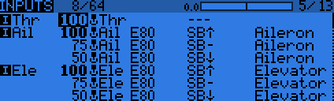

# Inputs

The next screen allows setting one or more input formatting rules to each stick axis. This is the first step of the control chain - where you define the amount of control authority you want on each stick.
 

As many lines as required can be assigned to each stick. The first one that has its condition on (starting from the top) will be the active one (shown in bold). This is commonly used to create dual, triple,... rates. 

To edit an entry long press the ENT button on the highlighted line.

The following fields are available:

 - Input name: 4 character identifier (used in MIXER screen)
 - Line name: 8 character identifier
 - Source - Choices are:

    * Sticks
    * Pots
    * MAX
    * Cyclic
    * Trims
    * Switches
 - 
 - 
A name can be defined for each entry, as well as the rate and exponential ratio. A curve (built-in or custom) can also be used instead of the "simple" exponential function.
The Modes line allows to choose in which flight mode(s) (highlighted numbers) that line can be active. If the current mode is not selected, turning on the switch will not activate that formatting line.
The Side parameter limits the effect of that formatting line to only one side of the stick. A summary of the selected modes for each line is shown on the main screen.

 (LONG press ENTER brings up a popup menu to insert/delete lines),