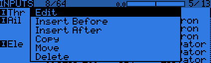
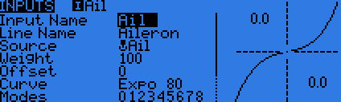
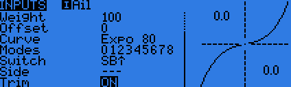
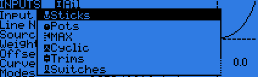

# Inputs

The next screen allows setting one or more input formatting rules to each stick axis. This is the first step of the control chain - where you define the amount of control authority you want on each stick.
 

As many lines as required can be assigned to each stick. The first one that has its condition on (starting from the top) will be the active one (shown in bold). This is commonly used to create dual, triple,... rates. 

To edit an entry long press the ENT button on the highlighted line.

The following fields are available:

 - Input name: 4 character identifier (used in MIXER screen)
 - Line name: 8 character identifier
 - Source - Choices are:

    * Sticks
    * Pots
    * MAX
    * Cyclic
    * Trims
    * Switches
 - Weight: percentage of stick travel (long press gives you Global variable)
 - Offset: starting point of travel
 - Curve - Choices are:
    * Diff
    * Expo
    * Func
    * Cstm - access to custom curves
 - Modes: choose which flight modes line is active
 - Switch: choose which switch activates line
 - Side: limits the effect of that line to one side of the stick x<0 or x>0
 - Trim: Trim on or off
 

 (LONG press ENTER brings up a popup menu to insert/delete lines),