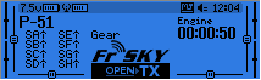
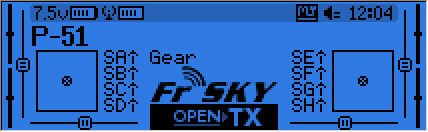
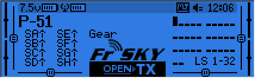
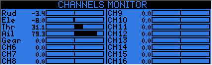

## Main views

We have 3 main views showing the same basic information in the top part and different inputs/outputs on the lower part. On the main views a long press of the ENTER key brings up a menu where you can reset the timers, telemetry data (min/max values, altitude, GPS home...), all of those, bring up a statistics view (throttle graph, timers), or show the developer credits. As mentioned above, a short press of the PAGE key switches views.
The new title bar includes radio battery voltage, receiver signal strength (for FrSky telemetry-capable receivers), main onboard voltage (can be receiver battery, flight battery, or anything else depending on sensors the "Voltage" parameter in the telemetry settings), status icons (SD present, USB connected, trainer port mode, logging in progress), audio volume and time.
The other "always present" items are model name, flight mode, and trim/pot positions. The logo is of course customisable, you'll be able to load your model's photo there! See this thread for a great collection of models made by the community.

* The first view lists the physical switch states in the bottom left zone, and the 2 timers (when enabled) on the right.

* The second shows the gimbal and switches positions, and is handy to check that all the physical controls respond as intended.

* The third shows again the physical switches on the left, and the states of the 32 custom (logic) switches on the right.

* The last view is a channel monitor showing the servo outputs for all 32 channels (+/- change page). If channel names are defined on the SERVOS page, they will show up here instead of the numbers for convenience.

