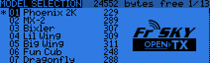

# Model Selection

A SHORT press of the MENU key from the main view brings up the model selection screen.

Navigation

 - +/- keys: move up/down model storage slots
 - LONG ENTER provides: 
    * Select model *(not active when model selected)
    * Backup model
    * Copy model
    * Move model
    * Delete model *(not active when model selected)
    * Create Model *(only active on an empty model slot)
    * Restore Model *(only active on an empty model slot)

 - SHORT ENTER - highlights the line where +/- create a copy of the model in the desired slot.
 - SHORT ENTER twice - creates dotted line outline where +/- moves the select model to another slot
 - PAGE key enters into currently selected model menus
 - LONG PAGE key brings you to Telemetry menu
