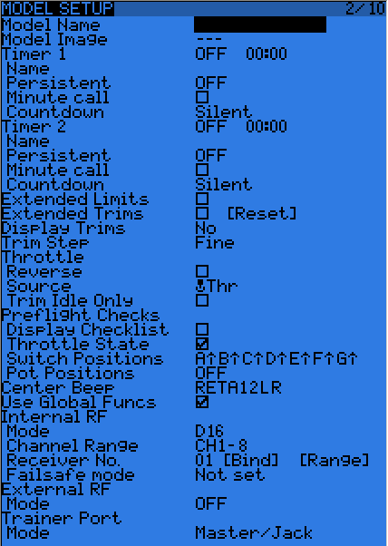

# Model Setup

Navigation keys

* A SHORT press of the PAGE key from the [model menu](./model_menus.md) brings up the basic model setup page
* +/- keys go to next or previous entry
* ENTER key starts editing field

While editing a field:
* ENTER SHORT - move to next character or finalize edit
* ENTER LONG - capitalize/lowercase current letter before moving to next

* Model name: Put the name of your model here.
* Model image: There you can select a 64x32px, 16-grayscale .bmp file located in the BMP folder of the SD card as your model logo. To be able to preview the images in the folder, use the SD Browser.

**Timers** 

There are up to 3 fully programmable timers, that can count either up or down.

* Timer
    * ON - always counting
    * Tht - starts the time the first time the throttle is advanced
    * THs - runs whenever the throttle stick isn't at idle 
    * TH% - counts up as a percentage of the full stick range. 
    * value - when set to 0:00 will count up from 0, if not they will count down from preset value
* Timer Name: Name displayed on Main screen for this timer, Timer 3 does not display
* Timer Persistent - if ticked, means the value is stored in memory when the radio is powered off or model is changed and will be reloaded the next time the model is used.
* Timer Minute Call: - will beep/say the time every full minute
* Timer Countdown - will give announcements serveral times during the last minute
* Extended limits allow setting servo movement limits up to 125% instead of 100%.
* Extended trims allows trims to cover the full stick range instead of +/-25%. Be careful when using this option, as holding the trim tabs for too long might trim so much as to render your model unflyable. The "Reset" item will reset all trims (for all flight modes).
* Trim step sets the precision of trim clicks. Exponential means very fine steps close to the trim center, but larger ones the farther you get from center.
* Throttle reverse: Ensures correct operation of throttle-based timers and functions for people who like having full throttle with the stick down.
* Throttle source defines what triggers the THx functions of the timers. It's common to set it to the throttle channel instead of the stick, so that throttle cut or other modifiers are taken into account.
* Throttle trim: IC engine mode, where trim only affects the idle part of the throw without touching the full throttle point.
* Throttle Warning: Will warn you if the throttle stick is not at idle when the radio is powered up or a model is loaded.
* Switch warning: Defines whether the radio requests the switches to be in predefined positions on power on/model change. To set them, arrange your switches the way you like, and press ENTER LONG.
* Center beep: Makes a beep when the selected control(s) pass the center point.
* Internal RF:
Mode: Transmission mode of the internal RF module (OFF, D16, D8, LR12).
Channel range: Choice of which of the radio's internal channels are actually transmitted over the air.
Receiver no (D16 / LR12 only): defines the behavior of the receiver lock function. This number is sent to the receiver, which will only respond to the number it was bound to. By default this is the number of the model's slot when it is created. It can however be changed manually, and will not change if a model is moved or copied. If manual setting or a copy/move operation results in 2 or more models on the radio having the same number, a warning popup will show up. It is then up to the user to determine if this is the desired behavior or not and change if required.
Bind and range check fields get activated by a press of the ENTER key. The radio will beep every few seconds to confirm. Range check will display a popup with the RSSI value to evaluate how reception quality is behaving.
Failsafe mode (D16 / LR12 only): Allows choosing between simply holding the last received positions, turning off pulses (like old PPM MHz receivers), or moving the servos to custom predefined positions. For custom positions a SET field will call the failsafe settings page, where the position can be defined separately for each channel. Select the desired channel, press ENTER to get in edit mode, move the control to the desired position, and press ENTER to save. In D8 mode this field is hidden, failsafe needs to be set on the receiver as described in the receiver's manual.
* External RF:
Module type: PPM for generic modules, XJT (same operation modes as above), DSM for Spektrum "hack" modules made using these instructions. Note that the Orange DSM and Spektrum DM9 modules both need PPM.
Channel range: same as for internal module.
Receiver no, Bind, Range check (when module type is XJT): Same as above.
PPM Frame (when module type is PPM): Allows setting the frame length, pulse length, and polarity of the PPM frame. The frame length is automatically adjusted to a safe value when the number of transmitted channels is changed. Advanced users can still adjust it afterwards if necessary.
Failsafe mode: When module type is XJT, same as above.
* Trainer mode: Master or slave, this setting defines which way the trainer port works. An icon is shown in the main view when the cable is inserted showing which mode is in use. In Slave (output) mode, the channels that should be sent and the PPM frame parameters are customizable just like for External RF -> PPM.
