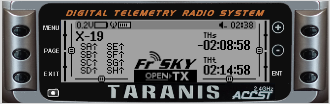

# Navigation

##Power up

When the radio is initially turned on and the throttle is not at idle, you will receive this warning.  Moving the throttle to idle or pressing one of +/-/ENT/MENU/PAGE/EXIT will remove the warning.

Moving indicated switch(es) to correct position will remove the warning. Also, pressing one of +/-/ENT/MENU/PAGE/EXIT will remove the warning.

The Main View uses the 6 keys as follows: 
- +/-: move "cursor" to next/previous field
- ENTER: used for item selection
- EXIT: used to back out of current context
- MENU key:
    * SHORT press - Model selection menu
    * LONG press - Radio menu
- PAGE key: Move to next main view
- PAGE key (LONG press): Telemetry views

In edit mode, we have four 2-key shortcuts available:
* +/- together: Invert value
* -/ENTER: Set value to 100
* EXIT/PAGE: Set value to -100
* MENU/PAGE: Set value to 0

On the main views, the PAGE key will switch between the different views described in the next section. A LONG press of the PAGE key will bring up the telemetry display. In those 2 menus, a SHORT press of the PAGE key goes to the next page, while a LONG press goes back to the previous one. EXIT goes back to the main views. In all model menu pages a long press of the MENU key will bring up a channel monitor to allow quickly checking the influence of a change in settings on the outputs.
The navigation in a menu is simple: The +/- keys will navigate up/down between editable fields, or lines of fields depending on the screen.
ENTER will enter the line of fields when applicable, then edit mode. In edit mode, +/- will change the value, ENTER or EXIT will validate the input and return to navigation. EXIT always goes back to the previous navigation level.

Another handy feature is the auto selection of physical inputs in the relevant fields. Instead of choosing a source or switch with the + and - keys, just move the pot or flick the switch you want, and it will be recognised. For switches the position is also auto-selected, and the +/- double key combination will allow selecting the opposite position (!Sxy) in a pinch.

