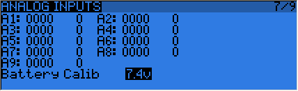

# Diagnostics

The next 2 pages are the switch and analog diagnostics, they will show you what the firmware reads from the radio's keys and potentiometers. This is the first place to go to if you run into issues with badly responding sticks / pots / switches. If things are wrong here (inconsistent stick centering or end point readings, flickering value,...) then you can be sure the problem is hardware-related and not due to wrong model setup.
The Analog page also features the battery calibration setting. It should be correct out of the box, but if not move the cursor to the field, and adjust it so that the displayed value matches the voltage you can measure on the battery terminals with a voltmeter.

