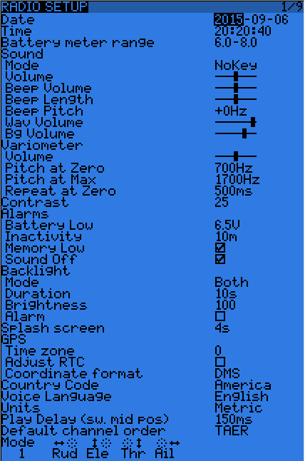
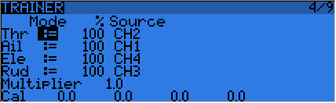

## Radio menus

A LONG press of the MENU key brings up the radio setup menu:

* Date/Time: To be set, they serve as info but also to give a correct timestamp to files and logs saved by the radio.
* Battery range: range of the graphical radio battery meter on the main views. To be set accordingly with the battery type you use (2s lipo here).
* Sound settings: Mode, Master volume, individual volumes of all mixed sources (Beeps, sound files, variometer, background music), beep duration and pitch.
* Contrast: Screen contrast setting.
* Alarms -> Sound off: if "Sound Mode" is "Quiet", the radio will not even sound warnings like a low battery. This alarm will remind you of that when turning the radio on.
* Inactivity alarm will remind you if you have forgotten to turn the radio off.
* Backlight -> Mode: If set to Keys, Controls or Both, the backlight will turn on when a stick/switch is moved and/or a key is pressed, for the duration set below.
* Backlight -> Alarm: Backlight will flash when an alarm sounds.
* Splash screen: On Taranis the splash will always be shown as the memory takes some time to load. Setting this on will just show it for longer.
* GPS time zone is there to show you the correct time when a GPS is present, and coordinate format lets you adjust display format to your liking.
* Country code: Must match your geographical location to keep RF transmission parameters within regulatory requirements.
* Voice language: Allows you to choose the language of the voice announcements. Note that the list contains all supported languages, but you also need to ensure a voice pack for that language has been loaded onto the SD card (in a subfolder of the SOUNDS directory).
* Units: Allows choosing between metric and imperial units for telemetry values.
* FAI mode (if the "FAI choice" option is selected in OpenTX companion): Disables all telemetry displays other than RSSI and voltage to comply with contest regulations. This is one-way, i.e. when you turn it on with this menu option it can't be disabled anymore, you need to connect the radio to the PC and use OpenTX companion to turn it off again (to prevent cheating). This allows you to come to the field, do your checks / test flights with telemetry, and turn the restricted mode on before the beginning of the contest on the radio itself.
* Default channel order: Defines the order of the 4 default mixers that are inserted on channels 1-4 when creating a new model. Set this to your preference. They can of course always be moved later, this is just a time-saving option.
* Mode: This is your stick mode, e.g. Mode 1 for throttle and aileron on the right stick, Mode 2 for throttle and rudder on the left stick.

### SD browser

A SHORT press of the PAGE key brings up the SD card browser page:

This allows you to browse the SD card contents.
On each file or folder, pressing ENTER will bring up a contextual menu with some basic file operations (copy/delete), as well as others depending on the file type.

Folders are organised as such:
* BMP folder: This is where you should place the 64x32, 4-bit grayscale .bmp files that you want to use as model logos. Filenames must be 10 chars long or less (not including extension). A collection of files is available here. Placing the cursor over a valid file in this folder will show it on the right side of the screen, and in the contextual menu you will find an entry to assign the selected image to the current model.
* LOGS folder: This is where you will find telemetry logs if enabled. Files will be created with the same name as the model they were saved from, with the date appended. One log file is created per day for each model.
* MODELS folder: Model files saved by the "Archive model" command of the model selection screen will be placed here. Similarly, models you want to reload using the "Restore model" of the same page need to be placed there beforehand.
* SOUNDS folder: This is where voice packs need to be placed. ZIP files with the standard voice packs can be downloaded from within OpenTX companion, or here. Extract the ZIP file to the root of the SD card, and it will create the necessary subdirectories (e.g. SOUNDS/en for the English pack). Any file you want to have available for the "Play Track" custom function needs to be placed within the language's directory as well. In this folder, the contextual menu includes a preview function.

The microSD card can be formatted by selecting the relevant option in the menu that appears when pressing MENU LONG. A confirmation will be required.

### Trainer

A SHORT press of the PAGE key calls the trainer settings page:

This page allows you to configure the trainer function for "master" use (make sure the Trainer mode in model settings is set to Master). For each of the 4 main functions you will be able to set the mode (OFF, += for Add, := for Replace), ratio and input channel.
Start by setting the mode for each function (the "standard" way is Replace i.e. when the trainer function is activated the function is fully transferred to the student, Add allows both master and student to act upon the function together). Then select the source channel accordingly to the brand/model of the student radio, and set the ratio to 100% for now. Now ensure the student radio is connected and recognised (moving the sticks of the student radio should change the 4 numbers at the bottom of the screen) make sure all its trims are neutral, all its sticks are centered (including throttle). Select the CAL field and press ENTER twice. The numbers should now be 0.0 or very close.
Now move the student radio's sticks and check the numbers vary from -100 to +100. Should they reach those values before the stick hits the end of its travel, reduce the ratio so that the throws match. Should they never reach -100 to +100 even with full stick deflection, use the Multiplier field to increase it.
Trainer input is now configured. Note that this setting is global, because it depends on the student radio regardless of the selected model. In order to use the Trainer function on a specific model you will need to assign the switch you want to the "Trainer" Custom Function for that model. More about this further.

### Version

This screen allows you to see the version of your currently loaded OpenTX firmware.

When reporting a bug, please be sure to include the revision number you see on the SVN line.

### Diagnostics

The next 2 pages are the switch and analog diagnostics, they will show you what the firmware reads from the radio's keys and potentiometers. This is the first place to go to if you run into issues with badly responding sticks / pots / switches. If things are wrong here (inconsistent stick centering or end point readings, flickering value,...) then you can be sure the problem is hardware-related and not due to wrong model setup.
The Analog page also features the battery calibration setting. It should be correct out of the box, but if not move the cursor to the field, and adjust it so that the displayed value matches the voltage you can measure on the battery terminals with a voltmeter.

### Hardware 

### Calibration

This is the place where you can calibrate sticks and pots. Follow the on-screen instructions, and note that when asked to center the sticks this includes the throttle stick and the 2 sliders. S1 and S2 pots however do not need to be centered, only the extremes are calibrated.

