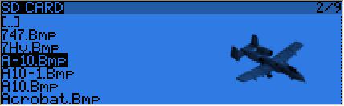

# SD Browser

A SHORT press of the PAGE key brings up the SD card browser page:

This allows you to browse the SD card contents.
On each file or folder, pressing ENTER will bring up a contextual menu with some basic file operations (copy/delete), as well as others depending on the file type.

Folders are organised as such:
* BMP folder: This is where you should place the 64x32, 4-bit grayscale .bmp files that you want to use as model logos. Filenames must be 10 chars long or less (not including extension). A collection of files is available here. Placing the cursor over a valid file in this folder will show it on the right side of the screen, and in the contextual menu you will find an entry to assign the selected image to the current model.
* LOGS folder: This is where you will find telemetry logs if enabled. Files will be created with the same name as the model they were saved from, with the date appended. One log file is created per day for each model.
* MODELS folder: Model files saved by the "Archive model" command of the model selection screen will be placed here. Similarly, models you want to reload using the "Restore model" of the same page need to be placed there beforehand.
* SOUNDS folder: This is where voice packs need to be placed. ZIP files with the standard voice packs can be downloaded from within OpenTX companion, or here. Extract the ZIP file to the root of the SD card, and it will create the necessary subdirectories (e.g. SOUNDS/en for the English pack). Any file you want to have available for the "Play Track" custom function needs to be placed within the language's directory as well. In this folder, the contextual menu includes a preview function.

The microSD card can be formatted by selecting the relevant option in the menu that appears when pressing MENU LONG. A confirmation will be required.
