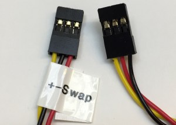
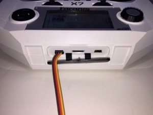
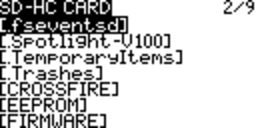
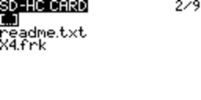
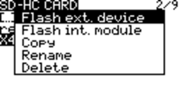
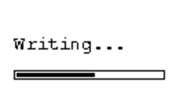

# S.Port Firmware Flashing

## File Preparation

- Download the firmware

  
  
- Place the firmware on the SDCARD in the FIRMWARE folder
  
  

- Ensure that the file name is 33 characters or less including the dot and extension

  
  
## Hardware Preparation

### All transmitters except for Taranis Q X7 shipped with bottom S.Port pins

- The external module bay’s +ve pin has the same voltage as the transmitter’s battery

  - Check that the device being flashed is rated for the transmitter’s battery voltage

  - If it is not then either change the battery or add a BEC/voltage converter in between the module bay’s  and device’s power pins

- Use a servo cable with the positive and negative wires swapped at one end

  

- Plug the modified servo cable on to the external module bay pins with the signal wire on the pin in the corner

  

- Plug the other end of the modified servo cable onto the S.Port pins of the device to be flashed

  

### Taranis Q X7 shipped with bottom S.Port pins

- Use a regular servo cable

- Plug one end into the bottom S.Port

  

- Plug the other end onto the S.Port pins of the device to be flashed

### Taranis Q X7 bottom S.Port pins added after shipping

- Will not work due to missing or incorrect circuit components

## Flashing Steps

- From the main view

  
  
- Long press MENU

  
  
- Press PAGE to get to the SD-HC CARD screen

  
  
- Scroll down to the FIRMWARE directory

  
  
- Press ENT to enter the directory

  
  
- Scroll down to the firmware file

  

- Long press ENT to display the pop up menu

- Select Flash ext. device

  
  
- Press ENT
  
- Wait for the progress bar screen to be displayed, it could take a few seconds

  
  
- When done the SD-HC CARD screen is displayed again

## FW Update Errors

- Not responding
  
  Check the connections
  
  Try a different device and corresponding firmware

  
  
- Module refused data

  Check connections

  Try a different device and corresponding firmware
  
  
  
