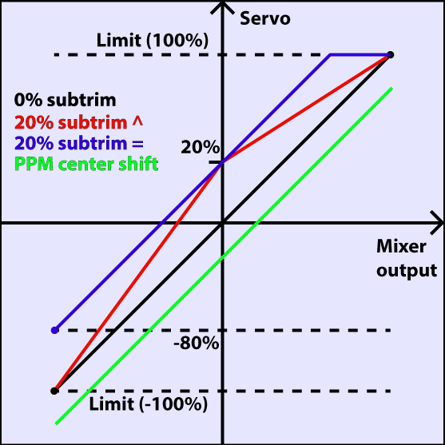

# Software overview

Now might be the time to put the battery on charge, so that after reading this section you can directly have a go at putting what you learned in practice!

## Button navigation

The Taranis has 6 input keys: a standard set of +/-/ENTER/EXIT, plus 2 contextual MENU and PAGE keys.
On the main views, the PAGE key will switch between the different views described in the next section. A LONG press of the PAGE key will bring up the telemetry display. A SHORT press of the MENU key will call the model menu, while a LONG press will call the radio settings menu. In those 2 menus, a SHORT press of the PAGE key goes to the next page, while a LONG press goes back to the previous one. EXIT goes back to the main views. In all model menu pages a long press of the MENU key will bring up a channel monitor to allow quickly checking the influence of a change in settings on the outputs.
The navigation in a menu is simple: The +/- keys will navigate up/down between editable fields, or lines of fields depending on the screen.
ENTER will enter the line of fields when applicable, then edit mode. In edit mode, +/- will change the value, ENTER or EXIT will validate the input and return to navigation. EXIT always goes back to the previous navigation level.
In edit mode, we have four 2-key shortcuts available:
* +/- together: Invert value
* -/ENTER: Set value to 100
* EXIT/PAGE: Set value to -100
* MENU/PAGE: Set value to 0
Another handy feature is the auto selection of physical inputs in the relevant fields. Instead of choosing a source or switch with the + and - keys, just move the pot or flick the switch you want, and it will be recognised. For switches the position is also auto-selected, and the +/- double key combination will allow selecting the opposite position (!Sxy) in a pinch.

## Model menus

A SHORT press of the MENU key from the main views brings up the model selection screen. There models can be selected, deleted, backed up and restored to/form SD card using the menu brought up by a LONG press on the ENTER key. They can also be copied or moved (one SHORT press on ENTER key highlights the line, +/- create and place a copy of the model on the desired slot, while two SHORT presses create a dotted outline where +/- simply move the selected model to another slot.)

### Model setup

A SHORT press of the PAGE key brings up the basic model setup page:

* Model name: Self-explanatory... Change letter with +/- keys, go to the next with ENTER SHORT, or press ENTER LONG to capitalize the current letter before switching to the next.
* Model image: There you can select a 64x32px, 16-grayscale .bmp file located in the BMP folder of the SD card as your model logo. To be able to preview the images in the folder, use the SD Browser.
* Timers: There are up to 3 fully programmable timers, that can count either up or down. If the value is set to 00:00 they will count up from 0, if not they will count down from the preset value. The trigger is set using the field next to the timer value, ABS counts up all the time, THs runs whenever the throttle stick isn't at idle, THt starts the timer the first time throttle is advanced, TH% counts up as a percentage of the full stick range. Persistent, if ticked, means the value is stored in memory when the radio is powered off or model is changed, and will be reloaded next time the model is used. Minute call will beep / say the time every full minute, while countdown will also give announcements several more times during the last minute.
* Extended limits allow setting servo movement limits up to 125% instead of 100%.
* Extended trims allows trims to cover the full stick range instead of +/-25%. Be careful when using this option, as holding the trim tabs for too long might trim so much as to render your model unflyable. The "Reset" item will reset all trims (for all flight modes).
* Trim step sets the precision of trim clicks. Exponential means very fine steps close to the trim center, but larger ones the farther you get from center.
* Throttle reverse: Ensures correct operation of throttle-based timers and functions for people who like having full throttle with the stick down.
* Throttle source defines what triggers the THx functions of the timers. It's common to set it to the throttle channel instead of the stick, so that throttle cut or other modifiers are taken into account.
* Throttle trim: IC engine mode, where trim only affects the idle part of the throw without touching the full throttle point.
* Throttle Warning: Will warn you if the throttle stick is not at idle when the radio is powered up or a model is loaded.
* Switch warning: Defines whether the radio requests the switches to be in predefined positions on power on/model change. To set them, arrange your switches the way you like, and press ENTER LONG.
* Center beep: Makes a beep when the selected control(s) pass the center point.
* Internal RF:
Mode: Transmission mode of the internal RF module (OFF, D16, D8, LR12).
Channel range: Choice of which of the radio's internal channels are actually transmitted over the air.
Receiver no (D16 / LR12 only): defines the behavior of the receiver lock function. This number is sent to the receiver, which will only respond to the number it was bound to. By default this is the number of the model's slot when it is created. It can however be changed manually, and will not change if a model is moved or copied. If manual setting or a copy/move operation results in 2 or more models on the radio having the same number, a warning popup will show up. It is then up to the user to determine if this is the desired behavior or not and change if required.
Bind and range check fields get activated by a press of the ENTER key. The radio will beep every few seconds to confirm. Range check will display a popup with the RSSI value to evaluate how reception quality is behaving.
Failsafe mode (D16 / LR12 only): Allows choosing between simply holding the last received positions, turning off pulses (like old PPM MHz receivers), or moving the servos to custom predefined positions. For custom positions a SET field will call the failsafe settings page, where the position can be defined separately for each channel. Select the desired channel, press ENTER to get in edit mode, move the control to the desired position, and press ENTER to save. In D8 mode this field is hidden, failsafe needs to be set on the receiver as described in the receiver's manual.
* External RF:
Module type: PPM for generic modules, XJT (same operation modes as above), DSM for Spektrum �hack� modules made using these instructions. Note that the Orange DSM and Spektrum DM9 modules both need PPM.
Channel range: same as for internal module.
Receiver no, Bind, Range check (when module type is XJT): Same as above.
PPM Frame (when module type is PPM): Allows setting the frame length, pulse length, and polarity of the PPM frame. The frame length is automatically adjusted to a safe value when the number of transmitted channels is changed. Advanced users can still adjust it afterwards if necessary.
Failsafe mode: When module type is XJT, same as above.
* Trainer mode: Master or slave, this setting defines which way the trainer port works. An icon is shown in the main view when the cable is inserted showing which mode is in use. In Slave (output) mode, the channels that should be sent and the PPM frame parameters are customizable just like for External RF -> PPM.

### Helicopter setup

A SHORT press of the PAGE key will bring up the helicopter CCPM head mixer page. This page allows setting a swashplate type, and limiting the control authority through the Swash Ring setting.

The inputs of this mixer are the Ail and Ele sticks, plus the virtual channel selected in "Collective source". This channel would see entries added on the MIXER page for one or more pitch curves.
The outputs of the CCPM mixer are CYC1, CYC2 and CYC3, which need to be assigned on the MIXER page to the channels you will connect your servos to.
Note that the settings made here have no effect unless you are using those CYC1, CYC2 and CYC3 sources. A multirotor or flybarless helicopter which uses onboard computers/mixers will NOT use them.

### Flight modes

Next up is the flight modes screen.

8 flight modes plus the default one are available for use. Each of them can be named, has a selectable activation switch (physical or logical), a trim selection array (R, E, T, A when shown mean the mode has its own trim setting for that control, but each can be changed to a number from 0 to 9 and thus use the same value as the specified mode), and slow up/down parameters for smooth transitions between modes.
The priority of the flight modes is such as the first FM of 1-8 that has its switch ON is the active one. When none has its switch ON, the default FM0 is active.

### Inputs

The next screen allows setting one or more input formatting rules to each stick axis. This is the first step of the control chain - where you define the amount of control authority you want on each stick.
 
As many lines as required can be assigned to each stick (LONG press ENTER brings up a popup menu to insert/delete lines), and again the first one that has its condition on (starting from the top) will be the active one. This is commonly used to create dual, triple,... rates. A name can be defined for each entry, as well as the rate and exponential ratio. A curve (built-in or custom) can also be used instead of the "simple" exponential function.
The Modes line allows to choose in which flight mode(s) (highlighted numbers) that line can be active. If the current mode is not selected, turning on the switch will not activate that formatting line.
The Side parameter limits the effect of that formatting line to only one side of the stick. A summary of the selected modes for each line is shown on the main screen.

### Mixer

The next page is where the actions on the controls will be mapped to servos. OpenTX does not have any predefined mixing functions that relate only to a particular model type or situation, it rather gives you a blank canvas you can build upon. The key to configuring a model on OpenTX is not to think about "activating the delta mix" like on certain radios, but rather to think about what you want your control on the model to do in response to an input on the radio's controls. The mixer is where all that "logic" gets entered.

The various channels are outputs, for example CH1 being the servo plug #1 on your receiver (with the default protocol settings). A channel without a mixer line will just center a servo that would be connected to it.
Each mixer line connects one input to the channel it's on. Inputs can be:
The 4 stick axes
The 4 pots and sliders
The heli mixer outputs (CYC1-3)
A fixed value (MAX)
The 8 physical switches
The 32 custom (logical) switches
The trainer port input channels (PPM1-8)
Each of the radio's 32 channels, which allows using channels as a virtual functions for clarity (mix several inputs into one reuseable function, that can then be assigned to one or more channels). Note that the settings of the SERVOS page are NOT taken into account there.
All inputs work on a -100% to +100% basis. Sticks, pots, channels, CYC sources, trainer inputs will vary proportionally within this range. 3-position switches will return -100%, 0% or +100%. 2-position switches (and logic ones) will return -100% or +100%. MAX is always +100%.
If you want the servo connected to the #2 plug of your receiver to be controlled by the elevator stick, you will simply create a mixer entry on CH2 with Ele as source. Easy enough!
There can be as many lines as needed on each channel, and the operation between each line can be selected. To create a new line, you would LONG press the ENTER key, and select insert before/after. By default all the lines on a same channel are added together, but a line can also multiply those before it, or replace them.
For clarity, each line that is currently active and contributing to the channel's output will have its source displayed in bold. This can be very handy when many are present and to check switch functions.

For each mixer line, several parameters are available:
A name can be entered for convenience
The weight (in %) of the input can be set. This sets how much of the input control has to be mixed in. A negative value inverts the response.
An offset on the input value can be added.
A trim can be used, for sticks this is by default the trim associated to the stick, but can be chosen to be one of the other trims (for cross-trimming for example) or disabled altogether. For other inputs the trim defaults to OFF, but can of course be set to one if required.
Either a differential value can be set (reduces response by the specified percentage on one side of the throw) or a curve (built-in or custom) can be assigned. When a custom curve is selected, a press of the MENU key will bring you to the curve editor.
The modes the mixer line is active in can be selected (see D/Rs).
A switch (physical or virtual) can be used to activate the mixer line.
A sound warning (1, 2 or 3 beeps) can be set to play whenever the line is active.
The Multpx setting defines how the current mixer line interacts with the others on the same channel. "Add" will simply add its output to them, "Multipl" will multiply the result of the lines above it, and "Replace" will replace anything that was done before it with its output. The combination of these operations allows creating complex mathematical operations.
Response of the output can be delayed and/or slowed down with regard to the input change. Slow could for example be used to slow retracts that are actuated by a normal proportional servo. The time is how many seconds the output will take to cover the -100 to +100% range.
As a little example, if you wanted to add some compensation on the elevator channel when you increase throttle, you would go through a simple path:
What's the control surface I want this to act on? Elevator, which is connected to CH2.
When do I want it to move? When I move the throttle stick, in addition to whatever would already be present (usually the elevator stick).
So you would simply go on CH2, and insert a new line with Thr as source. Type would be Add as the compensation needs to be added to the "normal" elevator response. As the required compensation is likely small, you will dial in a small weight, maybe 5%. On the ground with motor disconnected, you will check the elevator compensates in the correct direction. If not, you'll invert the weight to -5%.
You could then assign a switch, in order to be able to activate/deactivate it in flight to see if the amount of compensation is actually appropriate. If the correction is more complicated, you might want to assign and create a curve that matches what's required.

### Outputs

The SERVOS page is the interface between the setup "logic" and the real world with servos, linkages and control surfaces. Up to now, we have set up what we want our different controls to do, now is the time to adapt that to the mechanical characteristics of the model.

For each channel, we can define:
* A name, that will be shown on the mixer screen when the cursor is on a line belonging to that channel, on the channel monitor and on the failsafe settings page.
* An offset or subtrim.
* Low and high limits. These are "hard" limits, i.e. they will never be overridden, so as long as they are set so that your servo never forces, it really never will. They also serve as gain or "end point settings", so reducing limit will reduce throw rather than induce clipping.
* Servo reverse.
* Center adjustment. This is similar to subtrim, with the difference that an adjustment done here will shift the entire servo throw (including limits), and won't be visible on the channel monitor.
* Subtrim behavior: When set to default, adjusting subtrim will only shift the center of the servo throw. Given a -100% to +100% order from the mixer, the servo will still move exactly between the lower and upper limits, without clipping or dead band. This introduces a different stick to servo movement relation for both sides of the stick. Depending on the situation it can be either convenient or problematic, so the = setting has been added to change subtrim effect to rather shift the servo throw "symmetrically". A full throw order from the mixer can now be clipped by the limit that is on the same side as the subtrim, while on the other side the servo will not reach the limit anymore. That way on both sides of the stick a given stick movement always results in the same servo movement. Typically using the default mode allows for faster setup of servos that are driven by a single control input, while = is required to keep correct response of control surfaces using differential and/or mixing several inputs together. The = mode typically requires reducing D/R so that a margin is left between full "control" throw and the defined limits.

The following diagram illustrates the respective behavior of both subtrim modes and how Center adjustment compares to them:

The last line after CH32 is the "Trims to Offsets" function. It is used to take the trims of the currently selected flight mode, transfer their content to the subtrims, reset them, and adjust all other flight modes' trims. If you're close to running out of trim, instead of having to adjust every value one after the other, all it takes is to LONG press ENTER on this line and everything is done magically. Beware that you should still check if it would not be wiser to correct the problem mechanically, especially with large values, as depending on the subtrim behavior setting it might lead to either insufficient and asymmetric throws, or clipping/dead band.

### Curves

Custom curves can be used either in input formatting or mixers. There are 16 of them available, and they can be of several types (3, 5, 9, 17pt, both with fixed or user-definable x coordinates). 3pt would be a 3-point curve with fixed x, 9pt' is a 9-point curve with user-defined x coordinates.

These curves are available in addition to the "built-in" curves:
* x>0, x<0: If input is positive resp. negative return input, otherwise 0.
* |x|: Return the absolute value of the input.
* f>0, f<0: If input is positive resp. negative, return 100%, otherwise 0.
* |f|: If input is negative return -100%. If input is positive, return +100%.

The curve editor allows you to define a name for the selected curve, the type, and of course set the coordinates. When the cursor is on one of the editable coordinates, a LONG press of the ENTER key will bring up a menu where you can choose a standard preset curve, mirror the curve vertically, or reset all points.

### Global variables

Global variables are values that can be substituted to the usual number on every Weight, Offset, Differential or Expo setting. Their main use is to group the adjustment of several parameters that should have the same value. For example, aileron differential on a glider with 4 surfaces responding to the aileron function. When trying to find the sweet spot for the differential value, instead of having to repeatedly edit the differential value in 4 mixers, all 4 can be set to use a global variable (e.g. GV1 resp. -GV1, selected by a LONG press of the ENTER key on the Differential field). Then adjusting GV1 on this page is all it takes for all differentials to be updated.
Global variables are also flight mode specific, so instead of having to create separate mixer lines with different values depending on the flight mode one can simply use a global variable with different values for each flight mode. This can significantly help simplifying the mixer screen by avoiding many duplicate entries.
Global variables can also be adjusted in flight thanks to the Adjust GVx Custom Function that will be described later, and help adjusting those parameters that are easier to tweak in flight like D/R ratios, expos or again differential.
The Global variables screen allows setting a name for each of the 5 available variables for conveniency, and seeing/setting the value each of them will have in each of the 9 flight modes.

### Logical switches

These are logic switches that are used to compare values and combine various conditions.
The first "operation" column lists a few arithmetical, logical and differential operations. In arithmetical ones a and b represent variables, x represents a constant. Variables can be every source, i.e. all those available in mixers, plus the 5 global variables and all telemetry values. In logical operations the available sources are all physical and other custom switches. Differential functions compare the variation of a variable since last match to another value.

* a~x: active when variable a is approximately equal to constant x (hysteresis added, as comparing a stick's value for example would pretty much never trigger an exact match)
* a<x, a>x: Active when variable a is smaller resp. greater than constant x
* |a|<x, |a|>x: Active when the absolute value of variable a is smaller resp. greater than constant x
* a<b,a>b,a=b: See above, but with 2 variables
* AND, OR, XOR: Logical and, or, exclusive or between 2 binary inputs
* d>x, |d|>x: Active when the selected variable, respectively its absolute value has changed by more than x since last time. For example, d>x Alt 10 would trigger once every time Altitude goes up by 10m. |d|>x Alt 10 would trigger once every time Altitude goes up OR down by 10m.
* TIM: A timer, TIM 0.5 2.0 would be active for 0.5s, inactive for 2s, and repeat.

Custom switches offer 3 more parameters: An extra AND condition (if selected, must be on for the custom switch to become active), a Duration parameter (the minimum time a custom switch will be active for even if its conditions become false instantly), and a delay parameter (that affects both activation and deactivation). See the title bar header to see the function of the field the cursor is on.
A long press of the ENTER key on a custom switch's label will bring up a popup menu that allows you to copy/paste/delete an entry for more convenient entry of similar settings.

### Special Functions

This is the place where switches can be used to trigger special functions such as trainer mode, soundtrack playback, speech output of variables etc.

The first column selects the trigger, which can be any switch (physical or custom) or ON (always on). A LONG press of the ENTER key will switch to "toggle" mode (ending with t), i.e. the selected input will be turned on when the selected switch is activated, and will remain on until it is deactivated and reactivated again.
Scrolling through the list you will also find a few more options: One (triggers just once when loading a model or turning the radio on), SHdownS (short press of the momentary switch), SHdownL (long press of the momentary switch).

The available functions are:
* Safety CHx: When active, the output of CHx is forced to the selected value. A checkbox is there to enable the function, which you would typically do after ensuring the value is set correctly and the switch is off if your model is powered.
* Trainer, TrainerXXX: Enables trainer mode globally, and for individual functions. Unless a custom function is set for an individual function, turning the one set for Trainer automatically activates all 4 sticks.
* Instant trim: When activating the selected switch the current stick positions will be added to their respective trims. This is typically assigned to a momentary switch, and used on a maiden flight if you expect trims to be way off. Instead of frantically clicking the trim tabs, you would hold the sticks so that the model flies straight, and depress the switch once. It is best to remove that entry after the maiden flight, to avoid hitting it by mistake and bringing the model badly out of trim again.
* Play Sound: Play a simple tone from the available list.
* Reset: Resets the selected item (Timer 1, Timer 2, telemetry values, or all of those)
* Vario: Turns on variometer sounds (see Telemetry setup)
* Play track: Plays a sound file from the SD card, with repeats at the specified interval
* Play value: Speaks the current value of the selected parameter, with repeats at the specified interval
* SD Logs: Logs the telemetry values to SD card at the specified interval
* Volume: Adjusts sound volume using the selected source
* Backlight: Turns backlight on
* BgMusic, BgMusic || (pause): Plays a selected soundtrack from the SD card. The BgMusic Pause item pauses the track when activated and resumes it once inactive again, while switching BgMusic off stops the track completely.
* Adjust GVx: When active, sets the relevant global variable to the value of the specified source. The adjustment source can be one of 4 groups cycled through using a LONG press of the ENTER key:
A fixed value
A proportional control, or a channel with for example specified curve/weight/offset to limit the adjustment range
Another GVAR
+1/-1, to increment/decrement the GVAR with each activation.
A long press of the ENTER key on a custom function's label will bring up a popup menu that allows you to copy/paste/delete an entry for more convenient entry of similar settings.

### Telemetry

This page groups all the basic telemetry-related settings.

A1 and A2 are the 2 analog ports available on D8R receivers. X8R receivers only have A1, which measures the receiver's power supply. Range sets the maximum measurable voltage, i.e. 3.3V / (divider ratio). For example with the receivers' internal sensor (1:4), this would be 13.2V. For the FBVS-01 sensor with the default ratio of 1:6, this would be 19.8V. The number next to "Ax channel" will show the currently measured value, and can be used to confirm or correct the Range setting by comparing the reading with an external voltmeter. Offset and custom units (A, m/s, m, �, %...) can be used in addition to help scaling the input to accomodate 3rd-party analog sensors.
"Low" and "Critical" alarms for A1, A2 and RSSI will trigger audio warnings when the measured value goes below the defined levels. When a microSD card with a Taranis voice pack loaded is present in the slot, those alarms will be announced in clear voice (e.g. "A1 Low", "A2 Critical", "RF signal Low"). If no card is present each will trigger a different beep pattern. We do recommend the use of the voice capability as 6 different beeps can be difficult to remember under stress.
Blades: Number of blades for the RPM sensor.
Voltage/current: Allows choosing the input for the power calculation and mAh count features. These should match the input you've connected the corresponding sensors to.
Variometer source: sensor type that is installed in your model. "Vario" is for the new FrSky vario sensors as well as the openxvario (vertical speed is calculated by the sensor and transmitted digitally), A1/A2 are for analog sensors that transmit vertical speed as a voltage connected to the respective input. Limit sets respectively the maximum expected sink rate, low and high dead band (no sound), and maximum climb rate for the sounds generated by the Vario custom function. The low dead band can be set to OFF, which disables sink tones altogether.
Following those basic parameters are the selection lists for the 3 custom telemetry screens that can be seen by LONG pressing the PAGE key on the main views. Each screen can either show numerical parameters (9 in the main screen area and 3 in the bottom bar), or 4 bargraphs with configurable upper/lower limits.
 
Each field can be one of the various available parameters, of course the corresponding sensors and/or hub must be installed in the model:
Tmr1,2: Both timers
SWR: Transmitter antenna quality. Should always be below 51, or a popup warning will appear and an audio alarm will sound to warn you to check the radio's antenna. The value itself is of little meaning.
RSSI: Lowest of the RSSI values from the radio and receiver in D8 mode. In D16 mode, RSSI of the receiver.
Alt: Barometric altitude sensor
Rpm: Engine speed, number of blades is adjusted in the settings above
Fuel: Fuel level
T1,T2: Temperature sensors 1 and 2
Spd, Dist, GAlt: GPS speed, distance from starting point and GPS altitude
Cell: Lowest cell on FLVS-01
Cels: Sum of all cells on FLVS-01
Vfas: FAS-40/100 voltage measurement
Curr: Current, source configured in the settings above (FAS or analog)
Cnsp: mAh used totalizer (needs current source configured correctly)
Powr: Power, voltage and current sources configured above
AccX,Y,Z: Acceleration values from TAS-01
Hdg: GPS heading
Vspd: Vertical speed (either calculated by the radio or reported by the sensor, depending on the sensor type chosen above)
xxx+/xxx-: Min and max values of the available parameters
