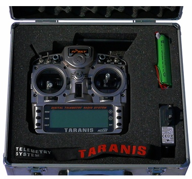
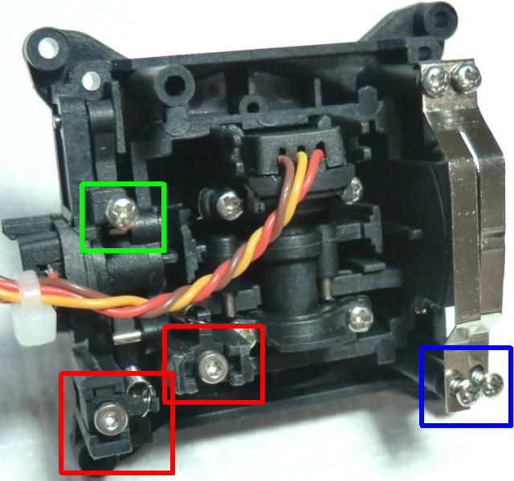

# The Taranis radio

## What you'll find in your package 

* An aluminium case (optional on newer sets)
* A radio!
* A 6-cell NiMH battery pack
* A charger that connects to the radio's charge port
* A nice neck strap
* Depending on the chosen combo, an X8R receiver

The FrSky Taranis is a ground-breaking radio because it's the first time a renowned player in the R/C industry and the creators of an open-source radio control firmware collaborate closely to improve both the hardware and software sides of a product, and come up with an open-source radio targeting the mainstream market. This means that while the Taranis is a low cost radio, it is free of the usual "marketing-driven" limitations that most manufacturers place on their offerings, and as such offers features that match and even exceed those of the highest end radios in the industry.
It is also future-proof, as both teams are always there to respond to questions and suggestions. Things can evolve quickly to follow the needs of the various users! And should you have some programming experience - the entire source code of the firmware is available for you to play with and change to your liking.

## An overview of the features

* Large 212*64 backlit LCD screen
* Quad ball-bearing gimbals with high quality potentiometers
* Numerous input controls (4 sticks, 4 trims, 2 sliders, 2 pots, 8 switches), all freely assignable
* 60 model memories
* 32 logical channels
* Internal telemetry-enabled RF module capable of transmitting up to 16 channels, with a refresh rate of 9ms. Supports the existing D8 protocol (useable with all D-type and VxR-II receivers) as well as the new D16 and LR12 modes.
* JR-compatible external RF module slot (no 6V supply) supporting transmission of up to 16 channels (depending on module) in various common protocols (PXX for FrSky modules and PPM for 3rd-party modules). Support for serial DSM2 for DIY Spektrum modules is also present (see the 9x mod guide for details).
* Mapping of the transmitted channels is free, so once an external module is added you have the choice of either creating a redundant system where the same channels are transmitted via both internal and external RF, transmitting up to 32 independent channels simultaneously, or anything in between.
* Internal RF (and external RF when an FrSky XJT module is fitted) supports receiver lock (X receivers only) and allows configuring failsafe conveniently from the radio with 3 modes: Hold, Stop pulses, Custom positions (only available with X-series receivers, D and V-II series use the usual receiver button press).
* Telemetry with 3 customisable screens and fully configurable speech announcements, supports existing receivers and sensors as well as new Smart Port sensors. Configurable metric or imperial units. * Integrated audio variometer (sensor required on the model). Data logging can be enabled on the supplied microSD card.
* Selectable stick mode (1-4), totally free output channel assignment.
* 3 timers, values can be stored when the radio is powered off
* 64 mixers
* 9 flight modes
* 16 custom curves with 3-17 points each, freely definable x coordinates
* 32 logic switches
* Standard JR-type 3.5mm trainer jack (PPM signal on tip, ground on sleeve, compatible with both mono and stereo plugs, ring unused if present), capable of receiving up to 8 channels as input, and sending up to 16 channels when configured as output. Master/slave mode and signal parameters are conveniently stored separately for each model.
* OpenTX companion Windows/Mac/Linux software to save, edit and share your models and settings as well as simulate your model setup
* USB connection for firmware upgrades, microSD card and OpenTX companion access
* Sticks can be calibrated by the end user
* Multiple language support: English, French, Italian, German, Swedish, Spanish, Portuguese, Czech, and maybe yours if you contribute with your own translation file! (Radio comes in English language, reflashing is needed to change language)
* Open source community-driven firmware, so unlike with major manufacturers if you need a special function or have good improvement suggestions just raise your voice, and don't be surprised if it's implemented a couple of days later! Visit http://www.openrcforums.com to meet the developers!

## The hardware

The radio has a relatively standard design and control layout, namely:
* 2 sticks and their associated trims, labelled in the software as Thr, Rud, Ele, Ail and TrmT, TrmR, TrmE, TrmA respectively. The stick to name mapping matches the selected stick mode. Trims are freely assignable (e.g. for cross-trimming), and can also be used as independent controls.
* 2 adjustment pots, S1 and S2
* 2 lateral sliders, LS and RS
* 6 3-position switches (SA-SE, SG)
* 1 2-position switch (SF)
* 1 momentary switch (SH)
When selecting a switch position to activate functions, it is referred to as the switch name followed by the physical position (SAup, SC-, SFdown). A ! before the name means NOT, so !SBdown would mean that the function is active when SB is NOT down, i.e. when SB is either up or in the middle.
A swiveling antenna is installed for the internal RF module, and a speech-capable speaker is located under the round grill. The large backlit, grayscale LCD and 6 edit keys take most of the lower part.

The back of the radio shows the JR-compatible module slot, along with a JR-style jack trainer port, USB connector and earphone jack. The battery bay houses a microSD card slot, a serial port and of course the battery connection.
The supplied battery is a 6-cell NiMH, but the plug will also accept a JST-style balance plug for a 2s Li-Po battery. Battery compartment dimensions are 108x31x28mm. Voltage range is 5.5-13V for the internal components, but be aware that external modules might require up to 12V, so observe your module's requirements when using one and choose the appropriate battery.
The right side of the radio sports the charger input plug, with the charging LED next to it on the back of the radio. When you connect the supplied power supply the LED will turn on, and shut off when the battery is charged (2-3 hours charge time for an empty battery).

**PLEASE NOTE: The radio has an integrated Ni-MH charge circuitry designed to charge the supplied 6-cell battery.**
* **Do not connect a smart charger to the charge plug. It should only be supplied with 12V DC, polarity however doesn't matter.**
* **Do not use the charge plug if you have replaced the battery with a different type (chemistry or cell count).**

The gimbals have adjustable length and tension, and each of the vertical axes is fitted with a spring disable feature as well as a ratchet and brake. This means that there is no need to swap parts to change modes, and that if you want to you can have either both or none of the vertical axes spring-loaded.

On the inside, the gimbals have 3 different types of screws:
* Y axis ratchet and/or "smooth braking" action strengths (blue)
* Y axis spring disable, screw it in to disable spring (green)
* X and Y spring tension (red), screw in for more tension, outer is Y of course.
It is good to note that if you like having weak stick tension, it is easy to get inconsistent centering when the spring tension screws are too loose. Just tighten them enough for centering to be good enough, and recalibrate.
Also, if you encounter a situation where your throttle stick does not “stay” at the ends when you release it, it is likely that that the spring disable screw (green) is simply not tightened all the way. Tightening it completely should solve your problem.
